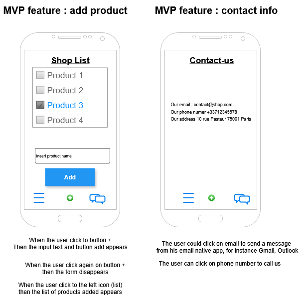

# Web app shopping list

## Context

Training students in Web development using a Web application for quickly creating food courses.

## Features

- [x] Add the product to your shopping list
- [ ] Remove a product from your shopping list
- [ ] Filter products by section
- [ ] Contact the company
- [ ] Find stores
- [ ] Ready-made lists
- [ ] Etc.

---

## Join us on development

1. Download and use your preferred Code Editor
2. Download [Git](https://git-scm.com/downloads)
3. Open the terminal in the project folder
4. In the terminal, run the command  `git clone https://github.com/BCDEV-ITIS/5-shoplist.git`
5. Always in the terminal, run the followinf command `cd 5-shoplist`
6. Open your editor on the folder 5-shoplist
7. Create a new branch to add new features or updates
8. push to the [GitHub repository](https://github.com/BCDEV-ITIS/5-shoplist.git)
9. Make a pull request to the maintainer

---

## Production

Application is running on the production server at [https://bcdev-itis.github.io/5-shoplist/](https://bcdev-itis.github.io/5-shoplist/)

---

## Mock-ups

MVP mock-ups

